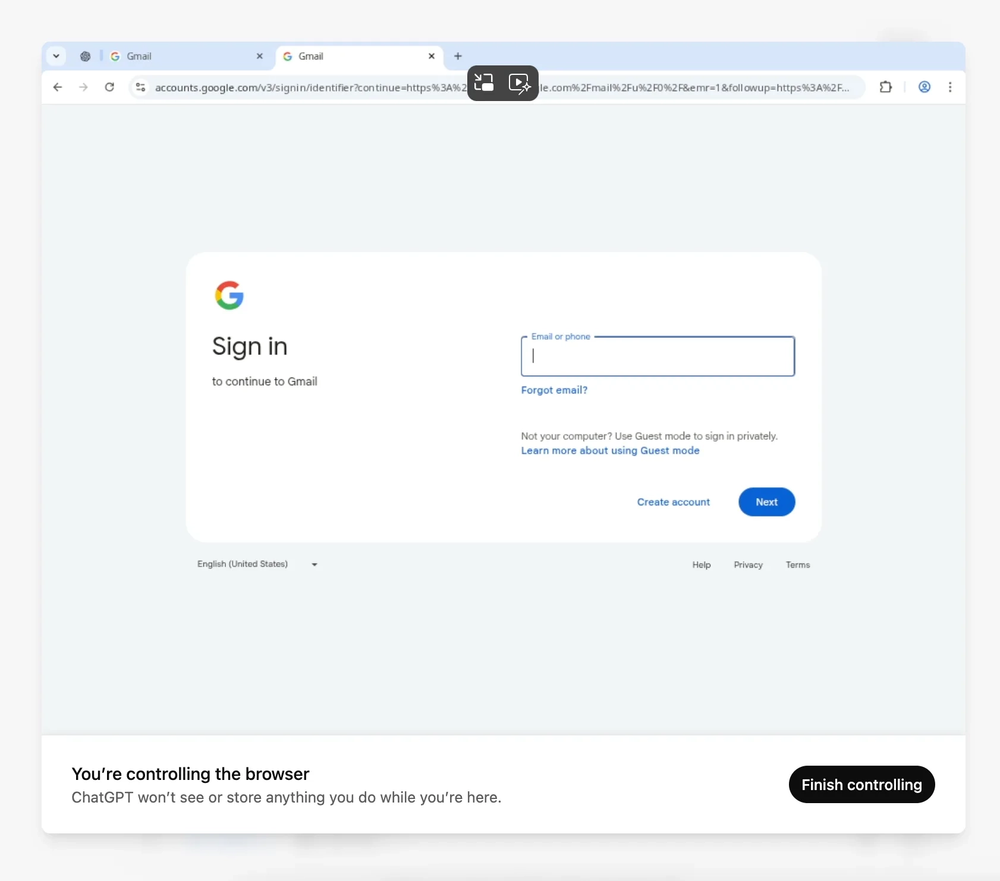

# 我的助手现在是个浏览器了

---

你还在手动搜索信息、复制粘贴、切换标签页吗？AI助手已经进化到能直接在浏览器里帮你干活了。从找人、发邮件到订机票，Perplexity的Comet浏览器让研究工作变得像聊天一样简单。这不是科幻，是我这周真实在用的工具。

---

今年年初，我为AI主题的书做调研时，雇了个助理。她很靠谱——刚毕业的大学生，想在全职工作之外赚点外快。她的主要工作是：

- 整理特定AI领域的研究文档（医疗、机器人等）
- 找出这些领域里做有趣事情的公司
- 挖联系方式，然后帮我发邮件

过去一年，AI悄悄接管了这些任务的大部分——尤其是前两项。现在几乎每个主流聊天机器人都内置了深度研究功能。但现在有了Perplexity的Comet浏览器，我基本把她的核心工作全交给AI了。

## Comet浏览器是什么

Comet在侧边栏里住着一个AI助手。它能搜网页、总结内容、提取信息，全程不用你开新标签页。它甚至能连接你的账户——比如Gmail——帮你起草和发送邮件。

举个例子。这周我想找那些因为AI被裁掉客服工作的人。我让Comet助手去LinkedIn上找相关帖子，然后帮我起草联系信息。不到一分钟，它扫完帖子和评论，拉出几个名字和链接，开始写外联邮件。这些内容就在侧边栏里——等我审核。

我甚至可以打开LinkedIn页面，开启截图功能，让它自己发消息。你能看着助手点来点去完成任务。当然，我还是想在发送前编辑和批准所有消息。

找邮箱地址也一样：Comet找到三个可能的地址，起草了介绍邮件，因为它和Gmail打通了，我直接点发送，不用离开界面。

它甚至能在你干别的事时帮你浏览网站。在United.com上，我让它找8月18日那周去芝加哥最便宜的航班。我在另一个标签页写这篇文章时，它找到了航班，甚至开始填我的个人信息（姓名、邮箱、性别），像个礼貌又有点过分热情的旅行代理。

👉 [想了解更多AI工具如何提升研究效率？点这里看看Perplexity能做什么](https://pplx.ai/ixkwood69619635)

## ChatGPT的Agent模式呢

我用OpenAI的新Agent模式试了类似任务。它找到的LinkedIn线索和邮箱地址差不多，但因为它运行在ChatGPT内部的虚拟浏览器里，你没法用自己的账户做太多事。而且不，我不会在OpenAI的虚拟沙盒里登录我的个人账户。

说清楚，Comet也有自己的隐私问题。你可以在设置里调整一些控制选项。Perplexity的CEO Aravind Srinivas在Reddit AMA里讨论了一些隐私保护和权衡。

据报道，OpenAI正在开发自己的浏览器，看到Comet这么好用，这完全说得通。与此同时，微软正在加班加点往Edge里塞更多Copilot功能。和AI工具交互的未来显然正在走向浏览器。

网络没死——只是会充满替我们点来点去的AI代理，这又带来了一整套隐私和安全问题。

## 缺点

Comet目前只对Perplexity Max订阅用户开放。对，就是那个每月200美元的套餐。否则你得加入等待名单——据公司说，已经有超过一百万人在排队。发言人告诉我，他们每天发出1万到5万份邀请，20美元/月的Pro用户应该"很快"能用上。也许两周内吧。

我还没完全放弃Microsoft Edge，它仍是我Mac上的主力浏览器。（是的，我知道，我每周都在坦白这件事。）但Comet现在已经成了我完成这本书研究工作的必备工具。

---

AI浏览器助手不是未来概念，而是现在就能用的生产力工具。从研究到外联，Comet把多步骤任务压缩成一句话指令。如果你也在做大量信息收集和整理工作，👉 [试试Perplexity，看看AI助手能为你的工作流程带来什么改变](https://pplx.ai/ixkwood69619635)。
